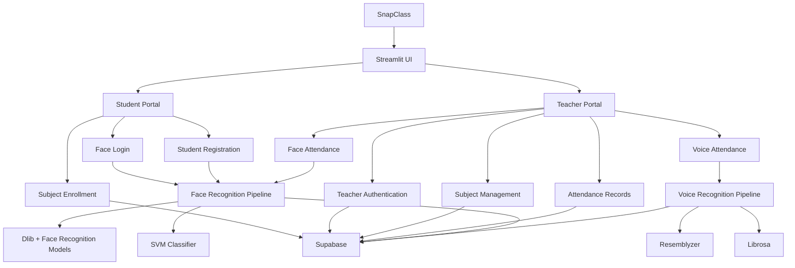

# 📚 SnapClass

### AI-Powered Attendance Management System

SnapClass is an AI-powered classroom attendance platform designed to make attendance **faster, smarter, and more convenient** using **face recognition and voice recognition**.

Instead of manually calling student names or maintaining attendance sheets, teachers can capture classroom photos or record classroom audio and let SnapClass identify enrolled students automatically.

---

## ✨ Features

### 👨‍🏫 Teacher Portal

* Teacher registration and login
* Create and manage subjects
* Generate subject joining links and QR codes
* View enrolled student counts
* Take attendance using classroom photos
* AI-powered face recognition
* AI-powered voice attendance
* Review attendance results before saving
* View historical attendance records
* Logout/session management

### 👨‍🎓 Student Portal

* Face-based student login
* Automatic new-student registration
* Optional voice profile enrollment
* Enroll in subjects using a subject code
* Quick enrollment through a shared link/QR code
* View enrolled subjects
* View attendance statistics
* Unenroll from subjects
* Logout/session management

### 🤖 AI Attendance

SnapClass supports two AI-based attendance mechanisms:

#### Face Recognition

The face pipeline uses:

* Dlib
* `face_recognition_models`
* 128-dimensional face embeddings
* Linear Support Vector Machine (SVM)
* Euclidean distance-based verification

The workflow is:

```text
Classroom Photo
      ↓
Face Detection
      ↓
Face Landmark Detection
      ↓
128-D Face Embedding
      ↓
SVM Classification
      ↓
Distance Verification
      ↓
Student Identification
      ↓
Attendance Result
```

#### Voice Recognition

The voice pipeline uses:

* Resemblyzer
* Librosa
* Voice embeddings
* Cosine-style similarity using vector dot products
* Audio segmentation for classroom recordings

The workflow is:

```text
Classroom Audio
      ↓
Audio Loading / Preprocessing
      ↓
Voice Activity Segmentation
      ↓
Voice Embedding
      ↓
Compare with Enrolled Voices
      ↓
Similarity Threshold
      ↓
Student Identification
      ↓
Attendance Result
```

---

## 🏗️ System Architecture



---

## 🛠️ Tech Stack

| Category             | Technology                  |
| -------------------- | --------------------------- |
| Frontend / UI        | Streamlit                   |
| Programming Language | Python                      |
| Database             | Supabase                    |
| Face Detection       | Dlib                        |
| Face Recognition     | Dlib Face Recognition Model |
| Face Classification  | Scikit-learn SVM            |
| Voice Recognition    | Resemblyzer                 |
| Audio Processing     | Librosa                     |
| Image Processing     | Pillow, NumPy               |
| Data Processing      | Pandas                      |
| Authentication       | bcrypt                      |
| QR Generation        | Segno                       |
| Backend Logic        | Python                      |
| Deployment Target    | Streamlit                   |

---

## 📁 Project Structure

```text
snapclass/
│
├── app.py
├── requirements.txt
├── .gitignore
│
└── src/
    │
    ├── components/
    │   ├── dialog_add_photos.py
    │   ├── dialog_attendance_result.py
    │   ├── dialog_auto_enroll.py
    │   ├── dialog_create_subject.py
    │   ├── dialog_enroll.py
    │   ├── dialog_share_subject.py
    │   ├── dialog_voice_attendance.py
    │   ├── footer.py
    │   ├── header.py
    │   └── subject_card.py
    │
    ├── database/
    │   ├── config.py
    │   └── db.py
    │
    ├── pipelines/
    │   ├── face_pipeline.py
    │   └── voice_pipeline.py
    │
    ├── screens/
    │   ├── home_screen.py
    │   ├── student_screen.py
    │   └── teacher_screen.py
    │
    └── ui/
        └── base_layout.py
```

---

# 🚀 Getting Started

## 1. Prerequisites

Make sure you have the following installed:

* Python 3.10+
* Git
* A Supabase project
* Webcam/camera access for face registration and login
* Microphone access for voice enrollment/attendance

Python 3.10–3.12 is recommended if you encounter compatibility issues with native packages such as Dlib.

---

## 2. Clone the Repository

```bash
git clone https://github.com/AbhinavPatel03/snapclass.git
cd snapclass
```

---

## 3. Create a Virtual Environment

### Windows

```powershell
python -m venv venv
```

Activate it:

```powershell
venv\Scripts\activate
```

### macOS / Linux

```bash
python3 -m venv venv
source venv/bin/activate
```

---

## 4. Install Dependencies

```bash
pip install --upgrade pip
pip install -r requirements.txt
```

The project uses packages including:

```text
streamlit
numpy
pandas
scikit-learn
dlib-bin
face_recognition_models
supabase
bcrypt
segno
pillow
librosa
resemblyzer
```

---

# 🔐 Supabase Configuration

SnapClass uses **Supabase** as its database.

The application reads the Supabase URL and key from Streamlit secrets:

```python
st.secrets["SUPABASE_URL"]
st.secrets["SUPABASE_KEY"]
```

Create:

```text
.streamlit/
└── secrets.toml
```

with:

```toml
SUPABASE_URL = "https://your-project.supabase.co"
SUPABASE_KEY = "your-supabase-key"
```

### ⚠️ Important

Never commit your real Supabase credentials to GitHub.

Add the following to `.gitignore`:

```text
.streamlit/secrets.toml
```

For deployment, configure the same secrets through the hosting platform's secret/environment-variable system.

---

# 🗄️ Database

SnapClass uses Supabase tables to store application data.

The codebase works with the following logical entities:

```text
teachers
students
subjects
subject_students
attendance_logs
```

### Teachers

Stores teacher authentication and profile information.

```text
teacher_id
username
password
name
```

Passwords are hashed using `bcrypt` before being stored.

### Students

Stores student profiles and biometric embeddings.

```text
student_id
name
face_embedding
voice_embedding
```

### Subjects

Stores classroom/course information.

```text
subject_id
subject_code
name
section
teacher_id
```

### Subject Students

Acts as the relationship between students and subjects.

```text
student_id
subject_id
```

### Attendance Logs

Stores attendance events.

```text
student_id
subject_id
timestamp
is_present
```

---

# 🧑‍🎓 Student Workflow

```text
Open SnapClass
      ↓
Student Portal
      ↓
Camera Login
      ↓
Face Detection
      ↓
Face Recognition
      ↓
┌───────────────────────┐
│ Recognized Student?   │
└───────────┬───────────┘
            │
       ┌────┴────┐
       │         │
      YES        NO
       │         │
       ↓         ↓
    Login     Register
       │       Profile
       │         │
       │    Face Embedding
       │         +
       │    Optional Voice
       │         │
       └────┬────┘
            ↓
      Student Dashboard
            ↓
      Enrolled Subjects
```

---

# 👨‍🏫 Teacher Workflow

```text
Teacher Portal
      ↓
Login / Register
      ↓
Teacher Dashboard
      ↓
┌──────────────┬─────────────────┬───────────────────┐
│              │                 │
Take          Manage            Attendance
Attendance    Subjects          Records
│              │                 │
↓              ↓                 ↓
Photo /       Create           Historical
Voice         Subject           Attendance
Analysis      + QR
```

---

# 📸 Face Attendance

Teachers can add classroom photographs and run face analysis.

For each image:

1. Faces are detected.
2. A 128-dimensional face embedding is generated.
3. The trained SVM classifier predicts the most likely student.
4. The predicted embedding is compared with the stored embedding.
5. A distance threshold is applied.
6. Identified students are marked present.
7. Students not identified in the submitted images are marked absent.
8. The teacher can review the results before attendance is logged.

The current face verification threshold is:

```text
0.6
```

---

# 🎤 Voice Attendance

Teachers can alternatively record classroom audio.

SnapClass:

1. Loads the audio at 16 kHz.
2. Preprocesses the waveform.
3. Splits the audio into speech segments.
4. Generates a voice embedding for each segment.
5. Compares the embedding against enrolled student voice profiles.
6. Uses a similarity threshold to identify speakers.
7. Generates an attendance result.

The current voice identification threshold is:

```text
0.65
```

---

# 📲 Subject Sharing

Teachers can create a subject and share it with students.

SnapClass generates a QR-based joining link.

Example:

```text
/?join-code=CS101
```

Students can use the shared link to quickly navigate to the student portal and enroll in the corresponding subject.

---

# 🔒 Security Considerations

SnapClass currently includes several security-oriented mechanisms:

* Teacher passwords are hashed using `bcrypt`.
* Supabase credentials are loaded through Streamlit secrets.
* Student face and voice data are stored as embeddings rather than raw biometric media.
* Teacher and student functionality is separated by application state.
* Subject enrollment is linked to authenticated student records.

### Recommended improvements before production deployment

For a production deployment, additional security should be implemented, including:

* Stronger authentication/session management
* Server-side authorization checks
* Row Level Security (RLS) policies in Supabase
* Strict validation of uploaded images/audio
* Encryption and access controls for biometric embeddings
* Rate limiting
* Audit logging
* Secure secret rotation
* Better protection against biometric spoofing
* Explicit consent and retention policies for biometric data

> **Privacy note:** Face and voice embeddings are biometric information. Any real-world deployment should obtain appropriate consent and comply with applicable privacy/data-protection requirements.

---

# 🎨 UI

SnapClass uses a custom Streamlit interface with:

* Student and teacher portals
* Custom dashboard styling
* Responsive Streamlit columns
* Dialog-based workflows
* Custom typography
* Subject cards
* Attendance result tables
* QR-based subject sharing

The interface uses custom styling built around:

```text
Climate Crisis
Outfit
```

and a colorful visual theme.

---

# ▶️ Running the Application

Once the environment and Supabase configuration are ready:

```bash
streamlit run app.py
```

Streamlit will provide a local URL, typically:

```text
http://localhost:8501
```

Open the URL in your browser.

---

# 🧪 Development

For development, activate your virtual environment first:

```powershell
venv\Scripts\activate
```

Then run:

```powershell
streamlit run app.py
```

When modifying the face-recognition pipeline, remember that the trained classifier is cached using Streamlit's resource caching.

The project explicitly clears the cached resources when a new student is registered so that the new face embedding can be included in the classifier.

---

# ⚠️ Known Development Issues

The current repository is an active development project rather than a fully production-hardened application.

Before deploying publicly, review and test:

* Streamlit session-state handling
* Supabase Row Level Security
* Biometric-data security
* Voice/face recognition thresholds
* Error handling for missing audio input
* Duplicate subject enrollment
* Database constraints
* Cross-platform Dlib installation
* Production authentication
* HTTPS/camera/microphone permissions
* Attendance validation and auditability

These areas are especially important when handling real student biometric information.

---

# 🗺️ Roadmap

Potential future improvements include:

* [ ] Better face-recognition accuracy
* [ ] Anti-spoofing / liveness detection
* [ ] Improved voice-recognition robustness
* [ ] Attendance percentage analytics
* [ ] Teacher analytics dashboard
* [ ] Student attendance charts
* [ ] Export attendance to CSV/Excel
* [ ] Attendance reports
* [ ] Calendar-based attendance
* [ ] Better authentication and authorization
* [ ] Supabase Row Level Security
* [ ] Mobile-friendly UI
* [ ] Automated attendance notifications
* [ ] Improved duplicate detection
* [ ] Cloud deployment
* [ ] Comprehensive automated tests
* [ ] Biometric data retention/deletion controls

---

# 🤝 Contributing

Contributions are welcome!

### 1. Fork the repository

```bash
git fork https://github.com/AbhinavPatel03/snapclass.git
```

### 2. Create a feature branch

```bash
git checkout -b feature/your-feature
```

### 3. Make your changes

Test the application locally before submitting your changes.

### 4. Commit your changes

```bash
git add .
git commit -m "Add: your feature"
```

### 5. Push the branch

```bash
git push origin feature/your-feature
```

### 6. Open a Pull Request

Describe:

* What you changed
* Why you changed it
* How you tested it
* Any limitations or known issues

---

# 📄 License

Add the project's chosen license here.

For example, if you decide to use MIT:

```text
MIT License
```

A `LICENSE` file should be added to the repository before publishing the project as an open-source project.

---

# 👨‍💻 Author

**Abhinav Patel**

GitHub:
https://github.com/AbhinavPatel03

Project:
https://github.com/AbhinavPatel03/snapclass

---

# ⭐ Support

If you find SnapClass useful, consider giving the repository a ⭐ on GitHub.

---

## 📌 Project Summary

> **SnapClass** is an AI-powered attendance management system that combines face recognition and voice recognition to automate classroom attendance. Teachers can manage subjects, capture classroom photos or audio, review AI-generated attendance results, and maintain attendance records, while students can authenticate using FaceID, enroll in subjects, and track their attendance.

**Built with ❤️ using Python, Streamlit, Supabase, Dlib, Scikit-learn, and Resemblyzer.**
